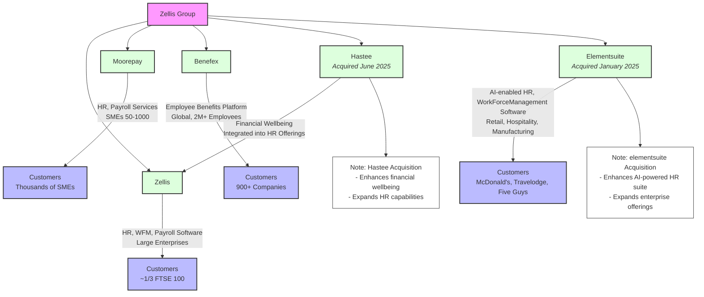
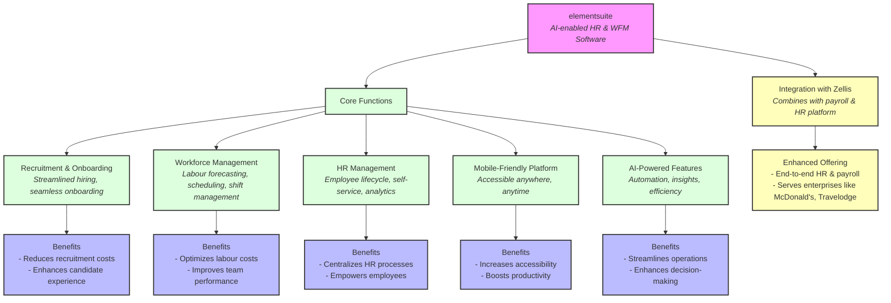
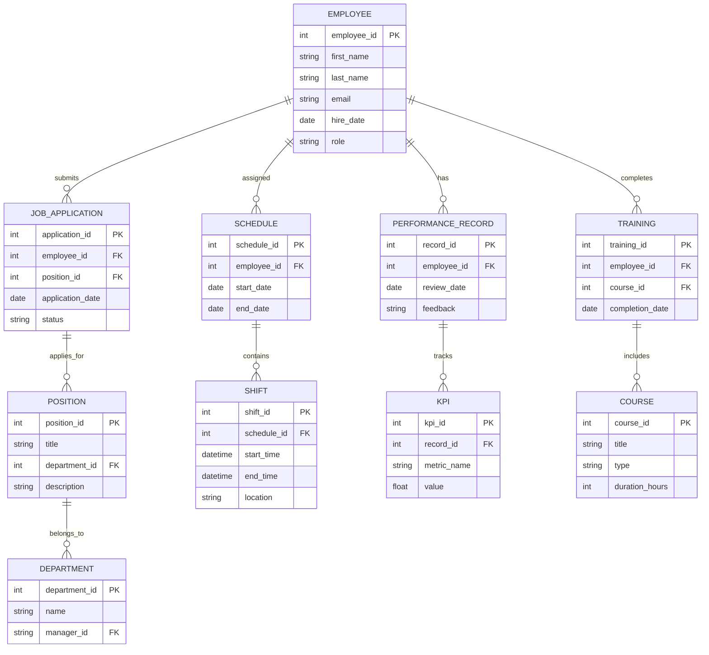

# Zellis Group Overview

Zellis Group is a leading provider of payroll, HR, and employee benefits solutions in the UK, Ireland, and globally. This document summarizes its products and recent acquisition of Hastee.

## Products and Acquisition Diagram

The following diagram illustrates Zellis Group’s business units (Zellis, Moorepay, Benefex) and the Hastee acquisition, highlighting their services and customer segments.

## Elementsuite Function Summary

## ElementSuite Questions

Will I get chance to work on / learn RUST ?

### Architecture 

- Is there an integration exercise incoming / ongoing?
- What are the databases, APIS in/out, messages in/out ?
- Where is it deployed to / run on ?
- What are the volumes ?

### Data Model ???

### Look Through Job Spec 

