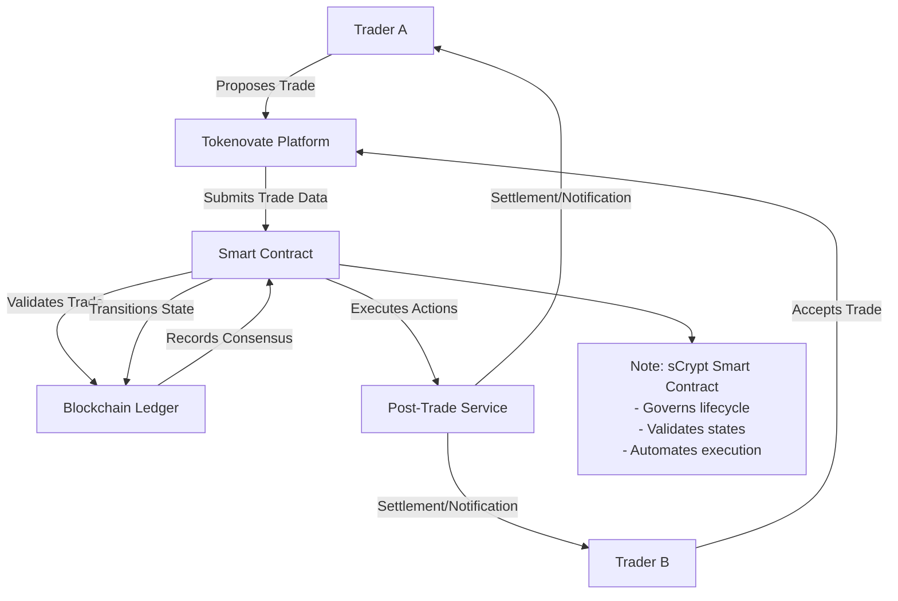

## Tokenovate Trade Flow Diagram

Is this a reasonable approximation of a trade lifecycle in a Tokenovate deployment,
that contains a smart contract for validation and state transitions?

## Tokenovate Deployment

How would I deploy this on Tokenovate?
Does deploying this make sense ?
Would Tokenovate tools / services create relevant endpoints / message topics ?

[TradeFlow.scrypt](TradeFlow.scrypt)
